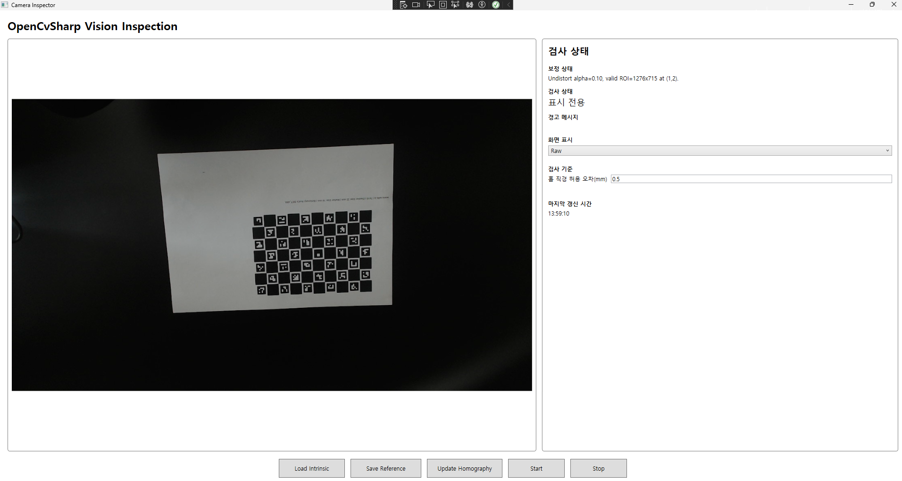
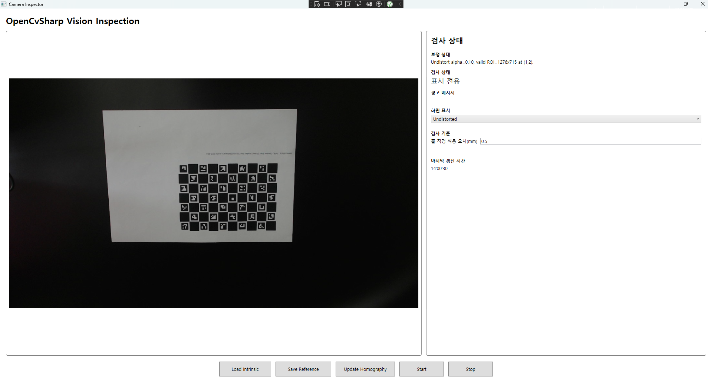
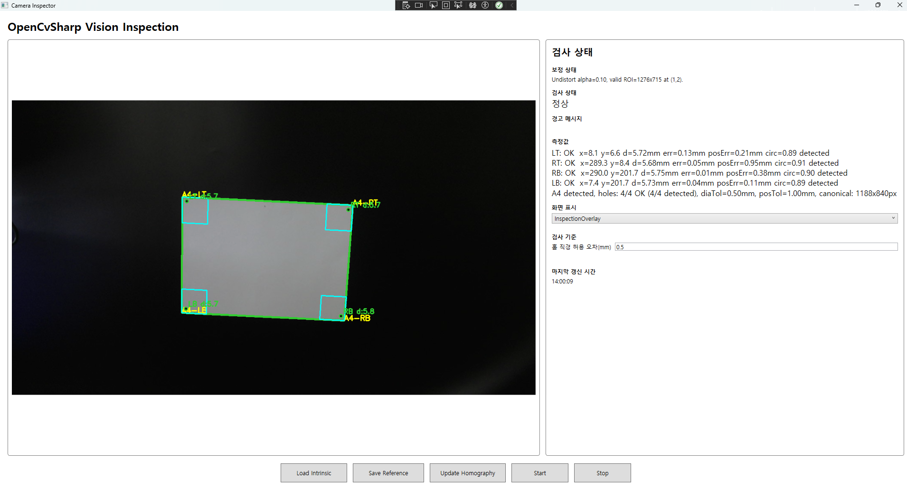
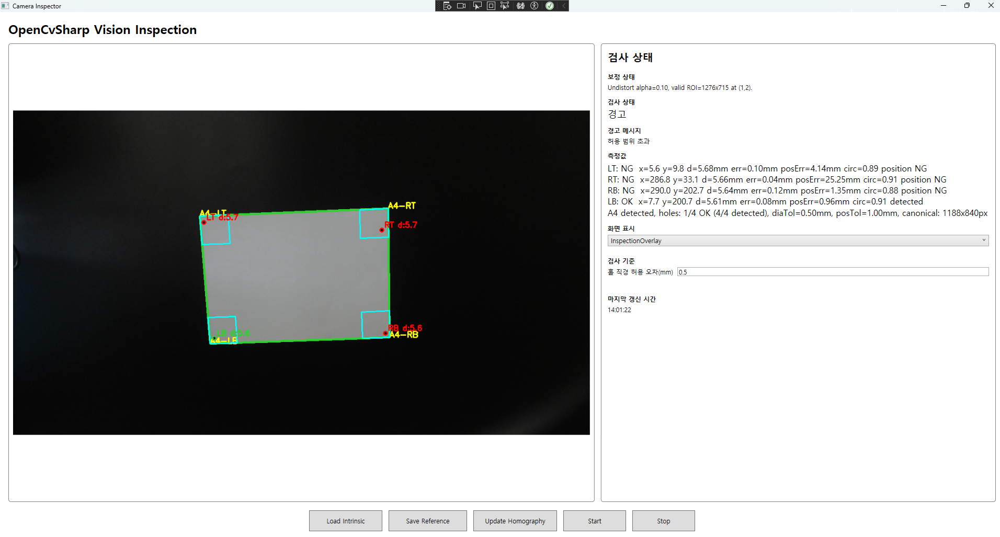

# Camera Inspector Project

Camera Inspector Project는 C#, WPF, OpenCvSharp를 기반으로 한 실시간 카메라 비전 검사 애플리케이션입니다.

카메라 영상을 입력받아 렌즈 왜곡 보정과 Homography 기반 좌표 보정을 적용하고, A4 기준면과 네 모서리 홀을 검출합니다. 이후 홀의 직경, 위치 오차, 원형도를 측정하여 기준값 대비 정상 여부를 판정합니다.

## Demo

[실행 영상 보기](./video.mp4)

> GitHub 환경에 따라 mp4가 README 안에서 바로 재생되지 않을 수 있습니다.  
> 이 경우 위 링크를 클릭해 영상을 확인할 수 있습니다.

## Project Overview

이 프로젝트의 검사 대상은 A4 크기 기준면과 네 모서리의 홀입니다.

기본 처리 흐름은 다음과 같습니다.

```text
Camera frame
→ Intrinsic calibration load
→ Lens undistortion
→ Homography update
→ A4 reference plane detection
→ Hole detection in corner ROIs
→ Diameter / position / circularity measurement
→ OK / Warning judgement
→ WPF UI display
```

## Visual Workflow

### 1. Intrinsic Load and ChArUco-based Undistortion



`Load Intrinsic` 버튼으로 카메라 내부 보정 데이터를 로드한 뒤, ChArUco Board를 이용해 보정 상태를 확인하는 화면입니다.

이 단계는 이후 검사에서 렌즈 왜곡으로 인한 위치 오차를 줄이기 위해 필요합니다.

<details>
<summary>Undistorted 화면 비교 이미지 보기</summary>



위 이미지는 Undistorted 표시 모드에서 보정된 화면을 확인하는 보조 이미지입니다.

</details>

### 2. Correct Object Detection



정상 검사 대상이 화면에 배치되었을 때의 Inspection Overlay 화면입니다.

A4 기준면이 검출되고, 네 모서리의 홀 위치와 직경이 기준 범위 안에 들어오면 검사 상태가 정상으로 표시됩니다.

### 3. Incorrect Object Detection



검사 대상이 기준값에서 벗어난 경우의 화면입니다.

홀은 검출되었지만 위치 오차 또는 직경 오차가 허용 범위를 초과하면 Warning 상태로 표시됩니다.

## Main Features

- 실시간 카메라 영상 표시
- Raw, Undistorted, InspectionOverlay 표시 모드 전환
- Intrinsic calibration JSON 로드
- ChArUco Board 기반 Homography 업데이트
- 렌즈 왜곡 보정 및 유효 ROI 계산
- A4 기준면 검출
- Perspective transform을 통한 canonical frame 생성
- 네 모서리 홀 검출
- 홀 중심 좌표 측정
- 홀 직경 측정
- 직경 오차 및 위치 오차 계산
- 원형도 계산
- OK, Warning, NoObject, Error, CalibrationRequired 상태 판정
- 현재 검사 결과를 기준 홀 데이터로 저장
- JSON 설정 파일 기반 검사 조건 관리

## Inspection Pipeline

검사 서비스는 한 프레임에 대해 다음 순서로 동작합니다.

```text
1. 카메라 프레임 입력
2. Intrinsic calibration 기반 렌즈 왜곡 보정
3. A4 기준면 후보 검출
4. A4 네 꼭짓점 정렬
5. canonical frame으로 perspective transform
6. 네 모서리 ROI 설정
7. 각 ROI에서 홀 후보 검출
8. 홀 중심, 직경, 원형도 계산
9. 기준값과 비교
10. 검사 상태와 overlay 결과 반환
```

## Architecture

프로젝트는 WPF UI, ViewModel, 검사 서비스, 보정 서비스, 모델 계층으로 나뉩니다.

```text
Camera_Insepctor_Project
├─ Views
│  └─ MainWindow.xaml / MainWindow.xaml.cs
├─ ViewModels
│  └─ MainViewModel.cs
├─ Services
│  ├─ InspectionService.cs
│  ├─ InspectionSettingsService.cs
│  └─ ImageStudyService.cs
├─ Calibration
│  ├─ CalibrationService.cs
│  ├─ CalibrationData.cs
│  ├─ FrameCorrectionService.cs
│  └─ camera_intrinsic.json
├─ Models
│  ├─ InspectionSettings.cs
│  ├─ InspectionResult.cs
│  ├─ InspectionState.cs
│  ├─ CameraDisplayMode.cs
│  ├─ HoleMeasurement.cs
│  └─ HoleReference.cs
└─ Configuration
   └─ inspection_settings.json
```

### UI Layer

`MainWindow`는 사용자의 버튼 입력과 화면 표시를 담당합니다.

주요 버튼은 다음과 같습니다.

- `Load Intrinsic`
- `Save Reference`
- `Update Homography`
- `Start`
- `Stop`

카메라 루프는 백그라운드에서 실행되며, 프레임 처리 결과는 UI 스레드에서 화면에 갱신됩니다.

### ViewModel Layer

`MainViewModel`은 화면에 표시되는 상태와 설정값을 관리합니다.

주요 역할은 다음과 같습니다.

- 보정 상태 표시
- 검사 상태 표시
- 경고 메시지 표시
- 측정값 표시
- 마지막 갱신 시간 표시
- 표시 모드 관리
- 검사 기준값 입력 관리

### Service Layer

`InspectionService`는 실제 비전 검사 로직을 담당합니다.

주요 역할은 다음과 같습니다.

- A4 기준면 검출
- 홀 검출
- 측정값 계산
- 기준값 비교
- 검사 상태 판정
- overlay 표시 정보 생성

`CalibrationService`는 Intrinsic calibration 데이터와 Homography 계산을 담당합니다.

`FrameCorrectionService`는 실시간 프레임의 렌즈 왜곡 보정을 담당합니다.

### Model and Configuration Layer

`Models` 폴더에는 검사 결과, 검사 상태, 홀 측정값, 홀 기준값, 설정값을 표현하는 데이터 모델이 포함됩니다.

`InspectionSettingsService`는 `Configuration/inspection_settings.json` 파일을 로드하고 저장합니다.

## Technology Stack

- Language: C#
- Framework: .NET 10.0 Windows
- UI: WPF
- Computer Vision: OpenCvSharp4
- Camera Input: OpenCV VideoCapture
- UI Pattern: INotifyPropertyChanged 기반 MVVM 구조
- Configuration: JSON
- Calibration: Camera matrix, distortion coefficients, ChArUco, Homography

주요 NuGet 패키지는 다음과 같습니다.

```text
OpenCvSharp4
OpenCvSharp4.runtime.win
OpenCvSharp4.Windows
```

## Basic Usage

1. 애플리케이션을 실행합니다.
2. `Load Intrinsic` 버튼으로 Intrinsic calibration JSON을 로드합니다.
3. 카메라 화면에 ChArUco Board를 위치시킵니다.
4. `Update Homography` 버튼으로 Homography를 갱신합니다.
5. 검사 대상 A4 기준면을 화면에 배치합니다.
6. 표시 모드를 `InspectionOverlay`로 전환합니다.
7. 실시간 검사 결과를 확인합니다.
8. 필요하면 `Save Reference` 버튼으로 현재 검출된 홀 정보를 기준값으로 저장합니다.

## Configuration

검사 조건은 `Configuration/inspection_settings.json`에서 관리합니다.

예시는 다음과 같습니다.

```json
{
  "cameraIndex": 0,
  "requestedCameraWidth": 1280,
  "requestedCameraHeight": 720,
  "expectedLongMm": 297.0,
  "expectedShortMm": 210.0,
  "toleranceMm": 0.5,
  "undistortAlpha": 0.1,
  "intrinsicCalibrationPath": "Calibration/camera_intrinsic.json",
  "expectedHoleDiameterMm": 6.0,
  "holePositionToleranceMm": 1.0,
  "holeReferences": []
}
```

주요 설정값의 의미는 다음과 같습니다.

| 설정값 | 설명 |
|---|---|
| `cameraIndex` | 사용할 카메라 번호 |
| `requestedCameraWidth` | 요청 카메라 해상도 너비 |
| `requestedCameraHeight` | 요청 카메라 해상도 높이 |
| `expectedLongMm` | A4 기준면의 긴 변 기준 길이 |
| `expectedShortMm` | A4 기준면의 짧은 변 기준 길이 |
| `toleranceMm` | 홀 직경 허용 오차 |
| `undistortAlpha` | 렌즈 왜곡 보정 alpha 값 |
| `intrinsicCalibrationPath` | Intrinsic calibration JSON 경로 |
| `expectedHoleDiameterMm` | 기준 홀 직경 |
| `holePositionToleranceMm` | 홀 위치 허용 오차 |
| `holeReferences` | 저장된 기준 홀 데이터 |

## Build and Run

Windows 환경에서 .NET SDK가 설치되어 있으면 다음 명령으로 빌드할 수 있습니다.

```powershell
dotnet build
```

Visual Studio에서는 솔루션 파일을 열고 WPF 애플리케이션으로 실행할 수 있습니다.

## Notes and Limitations

이 프로젝트의 측정 안정성은 소프트웨어뿐 아니라 촬영 환경의 영향을 받습니다.

특히 다음 조건이 중요합니다.

- 카메라 위치 고정
- 검사 대상과 카메라 사이의 거리 유지
- 일정한 조명
- 배경 반사 최소화
- Intrinsic calibration 정확도
- Homography 갱신 시 ChArUco Board 배치 안정성
- A4 기준면과 홀의 실제 치수 정확도

따라서 실제 검사 환경에서는 반복 측정을 통해 허용 오차와 기준값을 검증해야 합니다.
